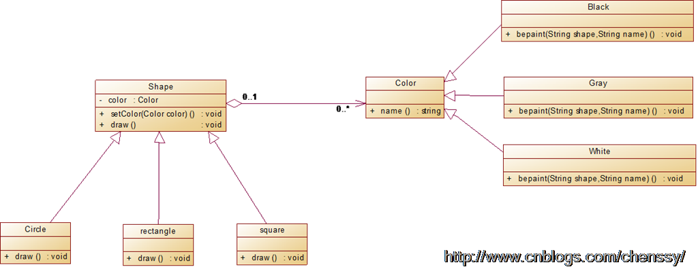

## Bridge (桥接模式)

Decouple an abstraction from its implementation so that the two can vary independently. 
Bridge pattern has structural purpose and applies to objects, so it deals with the composition of objects. 

### When to use

* you want to avoid a permanent binding between an abstraction and its implementation
* both the abstractions and their implementations should be extensible by subclassing
* changes in the implementation of an abstraction should have no impact on clients
* you want to hide the implementation of an abstraction completely from clients

### 参考链接

<https://www.runoob.com/w3cnote/bridge-pattern2.html>

